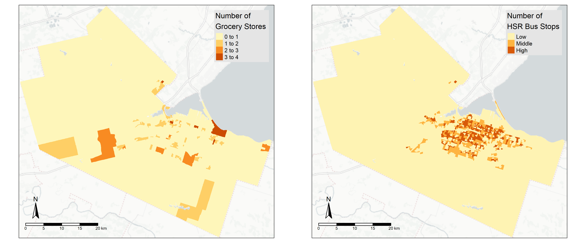

# Introduction and Background

Food is a necessity for human beings. In urban areas or large cities, residents typically rely on grocery stores for their daily food needs. Geographic access to grocery stores and affordable food plays an important role in promoting a healthy diet and has implications for personal health [@caspi2012relationship; @minaker2016retail; @kirkpatrick2014dietary]. The ease of accessing grocery stores and obtaining the needed food is thus an important topic for both public health and urban planning.

There is extensive literature on food access that examines this topic [@christian2012using; @widener2015spatiotemporal; @farber2014temporal; @widener2017changes]. These analyses mostly focus on the demand side, where consumers navigate and choose which retailers to purchase from. However, a gap exists in studying how retailers choose the locations of their stores to serve the market or the demand.

In this paper, I utilize open-source data from the 2021 Canadian Census [@census] and OpenStreetMap [@osm] to examine the spatial pattern of grocery store locations, using Hamilton, Ontario, as a case study. The research question is: What areas in Hamilton have more or fewer grocery stores compared to other areas?

# Data and Methods

```{r, echo=FALSE}
# no code chunk echo or message
knitr::opts_chunk$set(
  echo = F,
  message = F
)
```

```{r}
# load packages
library(sf)
library(tidyverse)
library(geog712package)
library(pscl)
library(units)
library(texreg)
library(mapview)
library(tidytransit)
library(tmap)
library(tmaptools)
library(marginaleffects)
library(patchwork)
```

```{r}
# read data
data("grocery_DA")

# reproject the data
grocery_DA <- st_transform(grocery_DA, crs = 26917)


# create a point for hamilton downtown
hamilton_downtown <- st_as_sf(data.frame(list("name"="hamilton downtown", 
                                              "x"=43.258657062558896, 
                                              "y"=-79.8707987387457)),
                              crs = 4326, coords = c("y", "x"))
hamilton_downtown <- st_transform(hamilton_downtown, crs = 26917)

# read hsr GTFS
hsr <- read_gtfs("https://github.com/zehuiyin/geog712package/raw/refs/heads/main/data-raw/fall2024_GTFS_static.zip")

# convert to hsr stops
hsr_stops <- st_as_sf(hsr$stops,
                      coords = c("stop_lon", "stop_lat"),
                      crs = 4326)
hsr_stops <- st_transform(hsr_stops, crs = 26917)

# get base map for Hamilton
hamilton_basemap <- read_osm(grocery_DA, 
                             type = "https://a.basemaps.cartocdn.com/light_nolabels/{z}/{x}/{y}.png")
```

## Study Area

My study area is the City of Hamilton, located on the west side of Lake Ontario in the province of Ontario. It has a population of `r as.character(sum(grocery_DA$v_CA21_1..Population..2021))` according to the 2021 Canadian census [@census]. The Niagara Escarpment runs through the middle of the city, dividing it into two parts. Figure \ref{fig:study_area} below shows the study area.

```{r, fig.cap="\\label{fig:study_area}Study Area: Hamilton, Ontario", fig.dpi=300, fig.height=4}
# Create a data frame with coordinates for the text
text_coords <- data.frame(
  x = c(-79.87024950208229),  # Longitude
  y = c(43.238133720160384),   # Latitude
  label = c("Hamilton Downtown")
)

# Convert the data frame to a simple feature (sf) object
text_sf <- st_as_sf(text_coords, coords = c("x", "y"), crs = 4326)

tm_shape(hamilton_basemap) + tm_rgb() + 
  tm_shape(st_union(grocery_DA)) + 
  tm_borders(col = "black", lwd = 2) +
  tm_shape(hamilton_downtown) +
  tm_bubbles(col = "red", size = 0.25) +
  tm_shape(text_sf) +
  tm_text("label", size = 1, col = "red") + 
  tm_compass() + tm_scale_bar() +
  tm_layout(attr.position = c("left", "bottom"))

tmap_save(filename = "images/study_area.png")
```

## Data Sources

I utilize three data sources in this paper, as shown in the Table \ref{tab:data_source} below. I gathered grocery store locations in Hamilton from OpenStreetMap [@osm] via the Overpass API [@overpass]. The Hamilton Street Railway (HSR) Fall 2024 GTFS static data were downloaded from Open Hamilton [@hsr_gtfs]. The dissemination area (DA) spatial data and 2021 Canadian census variables were obtained from @census through the cancensus package in R [@cancensus].

```{=tex}
\begin{table}[h]
\centering
\begin{footnotesize}
\begin{tabularx}{\textwidth}{XllXl}
\hline
Name                                           & Source              & URL                                             & Accessed Date \\
\hline
Grocery Stores in Hamilton                     & \cite{osm}          & \url{https://overpass-turbo.eu/index.html}      & 2024-10-04    \\
HSR Fall 2024 GTFS Static                      & \cite{hsr_gtfs}     & \url{https://opendata.hamilton.ca/GTFS-Static/} & 2024-10-04    \\
Dissemination Area and Census Data in Hamilton & \cite{census}       & \url{https://censusmapper.ca/api}               & 2024-11-16    \\
\hline
\end{tabularx}
\caption{\label{tab:data_source}Data Sources}
\end{footnotesize}
\end{table}
```

To facilitate reproducibility and open science, all the data used in this paper have been packaged into an R package [@geog712package], which is hosted on GitHub. You can access it at <https://github.com/zehuiyin/geog712package>.

## Methodology

The grocery store locations in Hamilton were intersected and aggregated to the census dissemination areas. The dependent variable of interest is the count of grocery stores in each dissemination area in Hamilton. There are 891 dissemination areas in Hamilton; however, due to data missingness, only 876 of them are used in the regression analysis. A considerable portion of the dissemination areas in our sample do not contain any grocery stores. Therefore, standard count models such as Poisson regression would be invalid due to the excessive zero values. To model this variable of interest, I fit a hurdle model and a zero-inflated negative binomial regression model with spatially lagged dependent variables.

The zero-inflated negative binomial regression model follows Equations \ref{eq:1} and \ref{eq:2} below [@zinb]. The variable specification in the hurdle model is exactly the same as in the zero-inflated negative binomial regression model. The hurdle model is set up with the zero component as a binomial logit model and the count component as a truncated negative binomial logit model. I decided to use negative binomial regression instead of Poisson regression because the count distribution is highly skewed, making it unlikely that the mean and variance would be the same for my variable of interest. Additionally, due to the large number of zeros in my sample, the zero-inflated regression is preferred, as it can generate zero values from two sources, unlike the hurdle model, which generates zeros from only one source.

```{=tex}
\begin{equation}
\label{eq:1}
Pr(GroceryStore_i=j) = \begin{cases}
       \pi_i + (1-\pi_i)g(GroceryStore_i=0) &\quad\text{if } j=0\\
       (1-\pi_i)g(GroceryStore_i) &\quad\text{if } j>0
     \end{cases}
\end{equation}
```

```{=tex}
\begin{equation}
\label{eq:2}
\begin{aligned}
logit(\pi) &= \rho \mathbf{W} GroceryStore + \tilde{\mathbf{x}} \tilde{\boldsymbol{\beta}} \\
\log\{E[g(GroceryStore)]\} &= \rho \mathbf{W} GroceryStore + \mathbf{x} \boldsymbol{\beta} \\
g(GroceryStore_i) &\text{ is the negative binomial distribution} \\
\mathbf{W} &\text{: a row-normalized queen contiguity matrix}
\end{aligned}
\end{equation}
```

# Results

## Descriptive Statistics

```{r, warning=FALSE}
# compute the number of hsr stops in each DA
stops_inter <- st_intersection(hsr_stops, grocery_DA)

stop_count <- stops_inter |> st_drop_geometry() |> group_by(GeoUID) |> count()

colnames(stop_count) <- c("GeoUID", "n_hsr_stops")

grocery_DA <- merge(x = grocery_DA, 
                    y = stop_count,
                    by = "GeoUID",
                    all.x = TRUE
                    )

grocery_DA[is.na(grocery_DA$n_hsr_stops),]$n_hsr_stops <- 0

# normalize it with area size
grocery_DA$n_hsr_stops_density <- grocery_DA$n_hsr_stops/
  grocery_DA$v_CA21_7..Land.area.in.square.kilometres

# convert it into a factor
hsr_level <- cut(grocery_DA$n_hsr_stops_density,
                 breaks = c(-1, quantile(grocery_DA$n_hsr_stops_density)[3:5]))

levels(hsr_level) <- c("low" , "mid", "high")

grocery_DA$hsr_level <- hsr_level
```

```{r, warning=FALSE}
# construct some independent variables

# population density
grocery_DA$pop_density <- grocery_DA$v_CA21_1..Population..2021/grocery_DA$v_CA21_7..Land.area.in.square.kilometres
grocery_DA$log_pop_density <- log(grocery_DA$pop_density + 1)

# log land area
grocery_DA$log_area <- log(grocery_DA$v_CA21_7..Land.area.in.square.kilometres)

# calculate distance to downtown
grocery_DA$dist_to_downtown <- st_distance(st_centroid(grocery_DA), 
                                           hamilton_downtown) |> drop_units()
grocery_DA$log_dist_to_downtown <- log(grocery_DA$dist_to_downtown)

# percentage of people age from 0 - 24
grocery_DA$PCT_aged_under_24 <- (grocery_DA$v_CA21_11..0.to.14.years + 
                                   grocery_DA$v_CA21_89..20.to.24.years)/
  grocery_DA$v_CA21_8..Total...Age*100

# percentage of people aged above 65
grocery_DA$PCT_aged_above_65 <- grocery_DA$v_CA21_251..65.years.and.over/
  grocery_DA$v_CA21_8..Total...Age*100

# percentage of people living in single detached house
grocery_DA$PCT_single_detached <- grocery_DA$v_CA21_435..Single.detached.house/
  grocery_DA$v_CA21_434..Occupied.private.dwellings.by.structural.type.of.dwelling.data*100

# percentage of people married or living common-law
grocery_DA$PCT_married_common_law <- grocery_DA$v_CA21_456..Married.or.living.common.law/
  grocery_DA$v_CA21_453..Marital.status.for.the.total.population.aged.15.years.and.over*100

# percentage of people with income less than 40k
grocery_DA$PCT_income_less_40k <- (grocery_DA$v_CA21_674..Under..10.000..including.loss. + 
                                     grocery_DA$v_CA21_677...10.000.to..19.999 + 
                                     grocery_DA$v_CA21_680...20.000.to..29.999 + 
                                     grocery_DA$v_CA21_683...30.000.to..39.999)/
  grocery_DA$v_CA21_671..With.total.income*100

# percentage of people with income greater than 100k
grocery_DA$PCT_income_greater_100k <- (grocery_DA$v_CA21_707...100.000.to..149.999 + 
                                         grocery_DA$v_CA21_710...150.000.and.over)/
  grocery_DA$v_CA21_671..With.total.income*100

# percentage of population with no knowledge of official language
grocery_DA$PCT_dont_know_official_language <- grocery_DA$v_CA21_1156..Neither.English.nor.French/
  grocery_DA$v_CA21_1144..Knowledge.of.official.languages.for.the.total.population.excluding.institutional.residents*100

# percentage of population who don't speak official language at home
grocery_DA$PCT_not_speak_offcial_language_at_home <- grocery_DA$v_CA21_2176..Non.official.language/
  grocery_DA$v_CA21_2167..All.languages.spoken.at.home.for.the.total.population.excluding.institutional.residents*100
```

```{r}
# construct a contiguity matrix
dist_m <- st_distance(grocery_DA)
dist_m <- drop_units(dist_m)
dist_m[dist_m == 0] <- -999
dist_m[dist_m != -999] <- 0
dist_m[dist_m == -999] <- 1
diag(dist_m) <- 0
```

```{r}
# compute spatial lags
# total number of grocery stores in neighbour CT
grocery_DA$Freq_sum_lag <- dist_m %*% grocery_DA$Freq

# total number of neighbour CT
grocery_DA$n_neighbour <- apply(dist_m, 1, sum)

# row normalize
grocery_DA$Freq_lag <- grocery_DA$Freq_sum_lag/grocery_DA$n_neighbour
```

```{r, results='hide'}
p_dep <- grocery_DA |> st_drop_geometry() |> 
  count(Freq) |>
  mutate(PCT = n/sum(n)*100) |>
  ggplot(aes(x = Freq, y = PCT)) +
  geom_col(fill = c("#d0d1e6",
                    "#a6bddb",
                    "#3690c0",
                    "#045a8d",
                    "#023858")) + 
  labs(x = "Number of Grocery Stores",
       y = "Percentage") +
  theme_bw()

ggsave("./images/dep.png", p_dep, width = 4, height = 3, dpi = 300)
```

Based on the bar chart in Figure \ref{fig:dep}, the distribution of the number of grocery stores in dissemination areas in Hamilton is highly skewed, with a large number of dissemination areas having no grocery stores. According to Figure \ref{fig:descriptive}, most grocery stores are located near the centre of Hamilton, within the Niagara Escarpment. There are also some dissemination areas at the edge of the city with grocery stores. In the right plot, the number of HSR bus stops per square kilometre is classified into three categories: low (0 to 50th percentile), middle (50th to 75th percentile), and high (75th to 100th percentile). The area with the highest transit service is also in the centre of Hamilton. Beyond the Niagara Escarpment, there are few transit stops.

```{r, fig.cap="\\label{fig:dep}Number of Grocery Stores in Dissemination Areas in Hamilton", out.height="3in", out.width="4in", fig.align='center'}

```

```{r}
descriptive1 <- tm_shape(hamilton_basemap) + tm_rgb() + 
  tm_shape(grocery_DA) + 
  tm_fill(col = "Freq", title = "Number of\nGrocery Stores") +
  tm_compass() + tm_scale_bar() +
  tm_layout(legend.position = c("right", "top"),
            legend.bg.color = "grey90",
            attr.position = c("left", "bottom"))
```

```{r}
descriptive2 <- tm_shape(hamilton_basemap) + tm_rgb() + 
  tm_shape(grocery_DA) + 
  tm_fill(col = "hsr_level", title = "Number of\nHSR Bus Stops",
          labels = c("Low", "Middle", "High"),
          palette = "seq") +
  tm_compass() + tm_scale_bar() +
  tm_layout(legend.position = c("right", "top"),
            legend.bg.color = "grey90",
            attr.position = c("left", "bottom"))

descriptive <- tmap_arrange(descriptive1, descriptive2, nrow = 1,
                            asp = 1.09)

tmap_save(descriptive, "./images/descriptive.png", width = 12,
          height = 5)
```

```{r, fig.cap="\\label{fig:descriptive}Number of Grocery Stores (left) and HSR Bus Stops (right) at Dissemination Areas in Hamilton, Ontario", out.height="2.5in", out.width="6in", fig.align='center'}

```

## Regression Results

```{r, results='hide'}
# fit a zero inflated negative binomial regression
m1 <- zeroinfl(Freq ~ Freq_lag + 
                 PCT_aged_under_24 + 
                 PCT_aged_above_65 +
                 PCT_dont_know_official_language +
                 PCT_not_speak_offcial_language_at_home +
                 PCT_single_detached +
                 PCT_income_less_40k +
                 PCT_income_greater_100k + 
                 PCT_married_common_law + 
                 log_dist_to_downtown +
                 log_pop_density |
                 log_pop_density +
                 PCT_not_speak_offcial_language_at_home + 
                 PCT_married_common_law +
                 hsr_level +
                 log_area +
                 Freq_lag,
               data = grocery_DA, 
               dist = "negbin")

summary(m1)

pR2(m1)
```

```{r, results='hide'}
m2 <- hurdle(Freq ~ Freq_lag + 
                 PCT_aged_under_24 + 
                 PCT_aged_above_65 +
                 PCT_dont_know_official_language +
                 PCT_not_speak_offcial_language_at_home +
                 PCT_single_detached +
                 PCT_income_less_40k +
                 PCT_income_greater_100k + 
                 PCT_married_common_law + 
                 log_dist_to_downtown +
                 log_pop_density |
                 log_pop_density +
                 PCT_not_speak_offcial_language_at_home + 
                 PCT_married_common_law +
                 hsr_level +
                 log_area +
                 Freq_lag,
               data = grocery_DA, 
               dist = "negbin")

summary(m2)

pR2(m2)
```

The regressions are estimated using the maximum likelihood method with the R package pscl [@pscl]. The hurdle model has a McFadden pseudo $R^2$ of `r round(pR2(m2)[[4]], digits = 2)`, while the zero-inflated negative binomial regression model has a McFadden pseudo $R^2$ of `r round(pR2(m1)[[4]], digits = 2)`. A pseudo $R^2$ around 0.17 is relatively small but common in this type of model and in social science. Table \ref{tab:regression_results} below presents the regression results.

```{r, results='asis'}
# render output
texreg(list(m2, m1),
       caption = "Regression results",
       label = "tab:regression_results",
       custom.model.names = c("Hurdle model",
                              "Zero-inflated model"),
       fontsize = "footnotesize",
       stars = c(0.001, 0.01, 0.05, 0.1),
       custom.coef.map = list(
         # Count model
         "Count model: Freq_lag" = "Count model: Spatial lag of grocery store count",
         "Count model: PCT_aged_under_24" = "Count model: Percentage of population aged below 24 years old",
         "Count model: PCT_aged_above_65" = "Count model: Percentage of population aged above 65 years old",
         "Count model: PCT_dont_know_official_language" = "Count model: Percentage of population don't know official language",
         "Count model: PCT_not_speak_offcial_language_at_home" = "Count model: Percentage of population don't speak official language at home",
         "Count model: PCT_single_detached" = "Count model: Percentage of population live in single detached houses",
         "Count model: PCT_income_less_40k" = "Count model: Percentage of population have annual total income less than 40K",
         "Count model: PCT_income_greater_100k" = "Count model: Percentage of population have annual total income more than 100K",
         "Count model: PCT_married_common_law" = "Count model: Percentage of population that are married or live in common-law",
         "Count model: log_pop_density" = "Count model: Natural log of (population density + 1)",
         "Count model: log_dist_to_downtown" = "Count model: Natural log of distance from DA centroid to Hamilton downtown",
         "Count model: hsr_levelmid" = "Count model: Number of HSR bus stops (50-75 percentile)",
         "Count model: hsr_levelhigh" = "Count model: Number of HSR bus stops (75-100 percentile)",
         "Count model: log_area" = "Count model: Natural log of area size in square kilometres",
         # Zero model
         "Zero model: Freq_lag" = "Zero model: Spatial lag of grocery store count",
         "Zero model: PCT_aged_under_24" = "Zero model: Percentage of population aged below 24 years old",
         "Zero model: PCT_aged_above_65" = "Zero model: Percentage of population aged above 65 years old",
         "Zero model: PCT_dont_know_official_language" = "Zero model: Percentage of population don't know official language",
         "Zero model: PCT_not_speak_offcial_language_at_home" = "Zero model: Percentage of population don't speak official language at home",
         "Zero model: PCT_single_detached" = "Zero model: Percentage of population live in single detached houses",
         "Zero model: PCT_income_less_40k" = "Zero model: Percentage of population have annual total income less than 40K",
         "Zero model: PCT_income_greater_100k" = "Zero model: Percentage of population have annual total income more than 100K",
         "Zero model: PCT_married_common_law" = "Zero model: Percentage of population that are married or live in common-law",
         "Zero model: log_pop_density" = "Zero model: Natural log of (population density + 1)",
         "Zero model: log_dist_to_downtown" = "Zero model: Natural log of distance from DA centroid to Hamilton downtown",
         "Zero model: hsr_levelmid" = "Zero model: Number of HSR bus stops (50-75 percentile)",
         "Zero model: hsr_levelhigh" = "Zero model: Number of HSR bus stops (75-100 percentile)",
         "Zero model: log_area" = "Zero model: Natural log of area size in square kilometres"
        )
       )
```

Both models have the same variable specification. Almost all the variables in the hurdle model's zero component are significant, while no variables in its count component are significant. Meanwhile, the zero-inflated negative binomial regression model has significant variables in both the zero and count components. Considering that the pseudo $R^2$ for the zero-inflated model is also higher than that of the hurdle model, the zero-inflated model provides a better fit compared to the hurdle model. Therefore, in the following sections, I will focus on interpreting the zero-inflated model.

The zero component in the zero-inflated negative binomial regression is a binary logit model predicting the probability of zero inflation. Thus, a positive coefficient indicates that the variable is contributing positively or increasing the probability of a specific dissemination area having zero grocery stores, while a negative coefficient suggests the opposite. The count component in the model is a negative binomial regression predicting the number of grocery stores in a dissemination area. Therefore, a positive coefficient indicates that an increase in the variable's value is associated with an increase in the expected count of grocery stores in that specific dissemination area.

The spatial lagged term of grocery store counts is a significant negative predictor in both components of the model. This indicates that a higher number of grocery stores in neighbouring dissemination areas would lower the number of grocery stores in the specific dissemination area, while it would reduce the probability that the specific dissemination area would have zero grocery stores. Thus, it has a non-monotonic effect on grocery store counts. Similarly, the natural log of population density plus one also has a significant negative effect on both components of the model. Additionally, the percentage of the population that does not speak an official language at home is significantly positively associated with more grocery stores. The percentage of the population living in single detached houses and the natural log of distance from the dissemination area centroid to Hamilton downtown both decrease the expected number of grocery stores in the dissemination area.

Regarding the zero component, the 50-75 percentile and 75-100 percentile in the number of HSR bus stops are significantly associated with a lower probability of having zero grocery stores compared to the reference category (0-50 percentile). Meanwhile, as the area size of the dissemination area increases, the probability of having zero grocery stores decreases.

```{r, results='hide'}
p1 <- plot_predictions(m1, condition = c("Freq_lag", "hsr_level")) +
  scale_color_manual(name = "Number of\nHSR Bus Stops",
                     values = c(
                       "low" = "#a6bddb",
                       "mid" = "#3690c0",
                       "high" = "#023858"
                     ),
                     labels = c(
                       "Low",
                       "Middle",
                       "High"
                     )) +
  scale_fill_manual(name = "Number of\nHSR Bus Stops",
                     values = c(
                       "low" = "#a6bddb",
                       "mid" = "#3690c0",
                       "high" = "#023858"
                     ),
                     labels = c(
                       "Low",
                       "Middle",
                       "High"
                     )) +
  labs(x = "Spatial Lag of Number\nof Grocery Stores",
       y = "Number of Grocery Stores") +
  theme_bw()

p2 <- plot_predictions(m1, condition = c("log_pop_density", "hsr_level")) +
  scale_color_manual(name = "Number of\nHSR Bus Stops",
                     values = c(
                       "low" = "#a6bddb",
                       "mid" = "#3690c0",
                       "high" = "#023858"
                     ),
                     labels = c(
                       "Low",
                       "Middle",
                       "High"
                     )) +
  scale_fill_manual(name = "Number of\nHSR Bus Stops",
                     values = c(
                       "low" = "#a6bddb",
                       "mid" = "#3690c0",
                       "high" = "#023858"
                     ),
                     labels = c(
                       "Low",
                       "Middle",
                       "High"
                     )) +
  labs(x = "Natural Log of Population\nDensity in Square Kilometres",
       y = "Number of Grocery Stores") +
  theme_bw()

p3 <- plot_predictions(m1, condition = c("log_area", "hsr_level")) +
  scale_color_manual(name = "Number of\nHSR Bus Stops",
                     values = c(
                       "low" = "#a6bddb",
                       "mid" = "#3690c0",
                       "high" = "#023858"
                     ),
                     labels = c(
                       "Low",
                       "Middle",
                       "High"
                     )) +
  scale_fill_manual(name = "Number of\nHSR Bus Stops",
                     values = c(
                       "low" = "#a6bddb",
                       "mid" = "#3690c0",
                       "high" = "#023858"
                     ),
                     labels = c(
                       "Low",
                       "Middle",
                       "High"
                     )) +
  labs(x = "Natural Log of Area\nSize in Square Kilometres",
       y = "Number of Grocery Stores") +
  theme_bw()

p4 <- p1 + p2 + p3 + plot_layout(guides = "collect")

ggsave("./images/margin.png", p4, width = 9, height = 3, dpi = 300)
```

```{r, fig.cap="\\label{fig:margin}Conditional Prediction Plot for the Zero-inflated Negative Binomial Regression Model", out.height="2.1in", out.width="6.3in", fig.align='center'}

```

Figure \ref{fig:margin} above shows the prediction plot for the zero-inflated model. The spatial lagged term and population density exhibit non-monotonic effects on grocery store counts. As the number of grocery stores in neighboring dissemination areas increases, holding all else constant, the expected grocery store count first increases and then decreases. Similarly, as the population density in the dissemination area increases, the expected grocery store count first increases and then decreases.

Dissemination areas with the number of HSR bus stops in the 50-75th percentile have the highest average grocery store count compared to the other two levels. It is not surprising that dissemination areas with the lowest transit access have the lowest expected grocery store count.

The model predicts that as the size of the dissemination area increases from approximately `r round(1/exp(2), digit=2)` to 1 square kilometres, holding all else constant, there would be an expected increase in the grocery store count. However, as the area size further increases or decreases, the grocery store count does not change significantly.

# Discussion and Conclusion

Based on the regression results, I found that grocery stores in Hamilton tend to be located in census dissemination areas where the neighbouring dissemination areas have, on average, 0.4 grocery stores. If neighbouring dissemination areas have more or fewer grocery stores on average, the expected number of grocery stores in that dissemination area decreases. An excess of grocery stores in nearby dissemination areas likely saturates the market, reducing the demand for new stores. Conversely, a lack of grocery stores in neighbouring areas might indicate an overall low demand in the local geography, which is also associated with a lower expected number of grocery stores in the specific census dissemination area. Additionally, evidence indicates that grocery stores tend to be located in dissemination areas with moderate population densities, approximately `r round(exp(8), digit=2)`. Low population density suggests a smaller market demand, while high population density might be associated with high land prices, constituting a high fixed cost for operating a grocery store.

As the dissemination area size increases to about 1 square kilometre, it exhibits the highest predicted number of grocery stores, indicating that a sufficient dissemination area size is needed for operating a grocery store. However, further increases in dissemination area size do not significantly impact the number of grocery stores, likely because many large dissemination areas in Hamilton are suburban areas around the city's edge with no grocery stores. The number of HSR bus stops is positively associated with the presence of grocery stores in a specific dissemination area, indicating that areas with better transit access are more likely to have grocery stores. Better transit access increases the potential catchment area of a grocery store, attracting more customers.

I also found that grocery stores tend to be located in areas with a higher percentage of the population that does not speak an official language at home, while the presence of single detached houses and the distance to Hamilton downtown are negatively associated with the presence of grocery stores. Non-English or French-speaking residents in Hamilton are more likely to be newcomers with limited mobility options and might choose to live in areas where they can easily access food. This could be due to institutional factors, as areas with many single detached houses and those far from Hamilton downtown might be residential zones where commercial activity is limited.

In this paper, I utilized open data to examine the spatial locations of grocery stores in Hamilton, Ontario. I found noticeable spatial patterns and effects in grocery store locations. Grocery stores tend to cluster together in nearby dissemination areas, but when there are too many grocery stores, they are more likely to disperse. The number of grocery stores is also significantly associated with population density, dissemination area size, the percentage of residents who do not speak an official language at home and live in single detached houses, and the distance to Hamilton downtown.

There are some limitations in this paper. Euclidean distances were used to measure the distance from the dissemination area centroid to Hamilton downtown, but a network distance could provide more accurate measurements. Additionally, distances could be computed using more sample points within a dissemination area instead of relying solely on the centroid. The model is based on a cross-sectional dataset, so no causal relationships can be concluded in this context. Utilizing a panel dataset with several years of census data could better shed light on the causal relationships between these variables and the number of grocery stores. Furthermore, the analysis treated all grocery stores equally, regardless of their physical size or sales volume. Using additional data sources to better capture the size of these businesses could help improve the model.

\pagebreak

# References {-}
